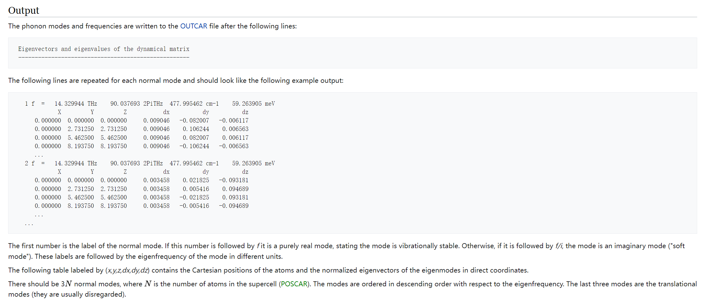

# vibration-plot-mode-in-vesta-2

## Abstract

This is an updated version of [vibration-plot-mode-in-vesta](https://github.com/faradaymahe/vibration-plot-mode-in-vesta) code. The main function is the same as older version, which is to automatically convert the vibration modes at **Γ point** calculated by other software in Vesta format file to visualize it. The improvements include:

- Simplify operating procedures and make it more automated: No more manual generation of initial Vesta files.
- More complete information: Beside the vibration modes in vesta file, other information such as vibration frequency, atoms cartesian coordinate etc is also exported to a csv file.
- **Supports converting results from more calculation software: Not only the results of vasp calculation, the calculation results of phonopy is also supported.**

## Usage

### **1.** Converting results from vasp calculation

#### **a**.  Perform phonons calculation in vasp
There are two methods to calculate phonons at Γ point in vasp. The first is [finite differences](https://www.vasp.at/wiki/index.php/Phonons_from_finite_differences).For [finite differences](https://www.vasp.at/wiki/index.php/Phonons_from_finite_differences) calculation, **IBRION** should be set 5 or 6, **NSW=1**, and **ISIF**, **POTIM**, **NFREE** should be set carefully.

The second method is [density-functional-perturbation theory](https://www.vasp.at/wiki/index.php/Phonons_from_density-functional-perturbation_theory), For [density-functional-perturbation theory](https://www.vasp.at/wiki/index.php/Phonons_from_density-functional-perturbation_theory) calculation, **IBRION** should be set 7 or 8, **NSW=1**.

After this step, you can get the **OUTCAR** from the calculation. Also, the input file **POSCAR** is alos needed for next step.

#### **b**.  Run python script
With **POSCAR** file and **OUTCAR** file from previous step, now run command 
```bash
python vasp_modes_to_vesta.py
```
and you can get the result.

The dependent libraries necessary for running of the python script is:
- [numpy](https://numpy.org/)
- [pandas](https://pandas.pydata.org/)
- [pymatgen](https://pymatgen.org/)
- sys, os, re

The parameters that need to be set in the python script are:
```python
dir_out_file = 'out'                                        # The directory for saving result file   
scaling_factor = 3                                          # The scale factor of the length of vector in VESTA file     
poscar_filename = './POSCAR'                                # The full path of POSCAR for VASP frequency calculation
outcar_filename = './OUTCAR'                                # The full path of OUTCAR generated in VASP frequency calculation
cmd_vesta_path = 'D:\VESTA-win64\VESTA-win64\VESTA.exe'     # The full path of VESTA command
```

### **2.** Converting results from phonopy calculation

#### **a**.  Perform force sets calculation in phonopy

Since phonopy itself cannot perform DFT calculation, this step requires the use of DFT software. vasp, quantum-espresso, abinit, etc. are all ok. Here is the referencce:
- vasp: [https://phonopy.github.io/phonopy/vasp.html#vasp-interface](https://phonopy.github.io/phonopy/vasp.html#vasp-interface)
- qe: [https://phonopy.github.io/phonopy/qe.html](https://phonopy.github.io/phonopy/qe.html)
- cp2k: [https://phonopy.github.io/phonopy/cp2k.html](https://phonopy.github.io/phonopy/cp2k.html)
- ...

Before calculating force sets, the input parameters of **supercell_matrix** and initial unitcell are also needed for next step, together with the force sets file generated in this step.

#### **b**.  Run python script
With **unitcell** file , **force sets** file and **supercell_matrix** from previous step, now run command 
```bash
python phonopy_modes_to_vesta.py
```
and you can get the result.

The dependent libraries necessary for running of the python script is:
- [numpy](https://numpy.org/)
- [pandas](https://pandas.pydata.org/)
- [pymatgen](https://pymatgen.org/)
- [phonopy](https://phonopy.github.io/phonopy/#)
- sys, os

The parameters that need to be set in the python script are:
```python
dir_out_file = 'out'                                        # The directory for saving result file  
scaling_factor = 3                                          # The scale factor of the length of vector in VESTA file             
supercell_matrix = [4, 4, 1]                                # The supercell matrix used for force sets calculation
unitcell_filename = './CONTCAR'                             # The unit cell used for force sets calculation
force_sets_filename = './FORCE_SETS'                        # The force sets file path calculated by Phonopy
cmd_vesta_path = 'D:\VESTA-win64\VESTA-win64\VESTA.exe'     # The full path of VESTA command
```

## Tips

### **1.**  How to read phonons calculation results from OUTCAR file



> [https://www.vasp.at/wiki/index.php/Phonons_from_finite_differences](https://www.vasp.at/wiki/index.php/Phonons_from_finite_differences)
